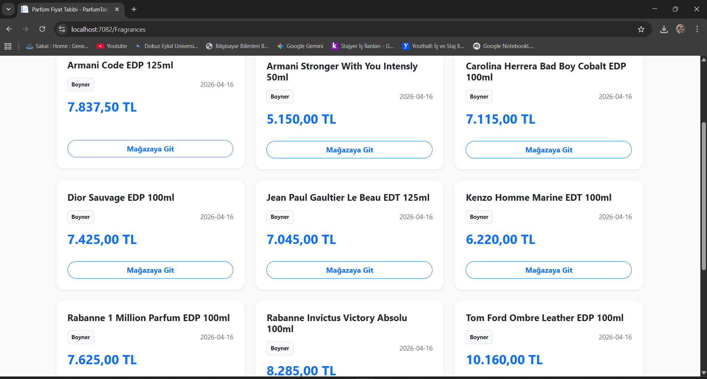
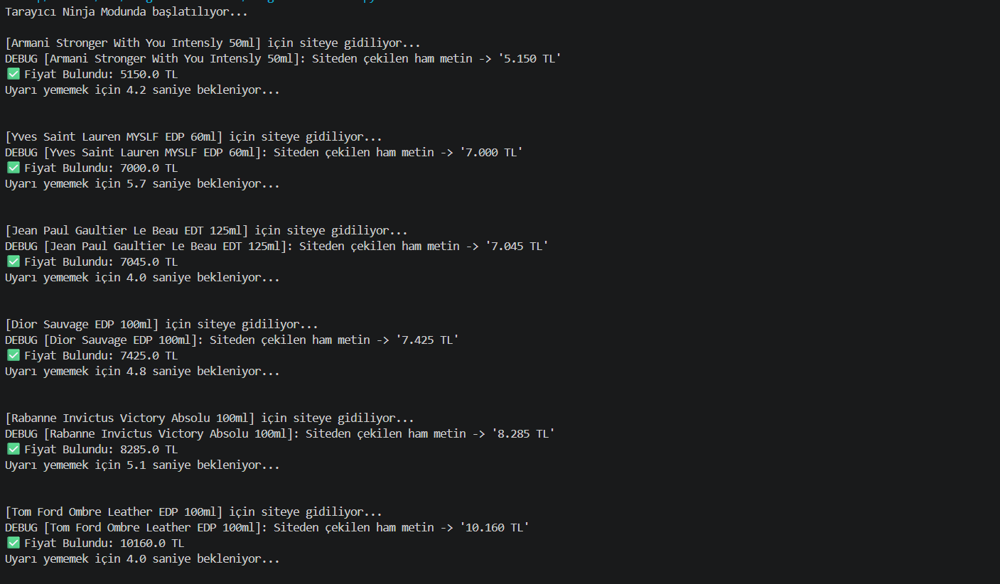

# 🕵️‍♂️ Smart Fragrance Tracker (Akıllı Parfüm Takip Sistemi)

Bu proje, favori parfümlerin fiyatlarını farklı mağazalardan (şu an için Boyner) otomatik olarak takip eden ve hedef fiyata ulaşıldığında e-posta yoluyla bildirim gönderen **uçtan uca (Full-Stack)** bir otomasyon sistemidir.

## 🚀 Öne Çıkan Özellikler
* **Otonom Veri Kazıma:** Python & Selenium kullanarak dinamik web sayfalarından anlık fiyat çekimi.
* **Akıllı Bildirim:** SMTP protokolü ile hedef fiyat kontrolü ve anlık e-posta uyarısı.
* **Modern Web Arayüzü:** ASP.NET Core MVC ile geliştirilen, veritabanındaki fiyatları şık kartlar halinde sunan kontrol paneli.
* **İnsani Bot Davranışı:** Anti-ban koruması için rastgele bekleme süreleri (Randomized Delay).
* **Dinamik Fiyat Temizleme:** Mağaza kampanyaları ("Sepette %10 İndirim" vb.) kaynaklı HTML değişikliklerini otomatik algılama ve temizleme.
## 📸 Uygulamadan Görüntüler

### Web Arayüzü (ASP.NET Core MVC)

### Botun Çalışma Anı

## 🛠 Teknoloji Yığını
* **Backend:** Python 3.x, C# (.NET)
* **Web Framework:** ASP.NET Core MVC
* **Otomasyon:** Selenium WebDriver
* **Veritabanı:** SQLite
* **Tasarım:** Bootstrap 5, CSS3

## 🔧 Kurulum
1. Gerekli kütüphaneleri kurun: `pip install selenium webdriver-manager`
2. `FragrancesTracker.py` içerisindeki `GONDERICI_MAIL` ve `GONDERICI_SIFRE` alanlarını kendi bilgilerinizle doldurun (Gmail için "Uygulama Şifreleri" kullanılmalıdır).
3. Veritabanını (`parfum_fiyatlari.db`) oluşturmak için Python dosyasını bir kez çalıştırın.
4. ASP.NET MVC projesini Visual Studio üzerinden ayağa kaldırıp web arayüzüne erişin.

---
*Bu proje Dokuz Eylül Üniversitesi Bilgisayar Bilimleri öğrencisi Özgür Altınışık tarafından geliştirilmiştir.*
